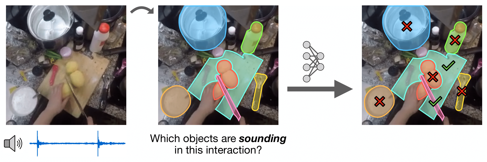

# Clink! Chop! Thud! — Learning Object Sounds from Real-World Interactions

[Project Page](https://clink-chop-thud.github.io/) | [arXiv](https://arxiv.org/abs/2510.02313)


## Motivation

<p align="center">
  
</p>

Humans handle a wide variety of objects throughout the day and many of these interactions produce sounds. We introduce a multimodal *object-aware* framework that learns the relationship between the objects in an interaction and the resulting sounds. This enables our model to detect the *sounding objects* from a set of candidates in a scene.

## Installation


## Data

Two datasets are used in this project: Ego4D and Epic Kitchens.

All the required data files, EXCEPT for the training video clips for Ego4D (as it is too large), can be downloaded from Dropbox [here](https://www.dropbox.com/scl/fo/0vuwhtlp9nwhyx0im4hhh/AEdBpi14WdkYrfUR9GgrYcM?rlkey=2uv9hb0qzlcc7zvtbz550zqfr&st=66l43cui&dl=0). The training clips are only needed if you wish to retrain the model from scratch. To do so, please refer to the [Ego4DSounds project page](https://ego4dsounds.github.io/) on downloading the dataset.

1. Download all files from the Dropbox folder
2. Unzip the .tar.gz files with `tar -xzvf {archive_name}.tar.gz`
3. Place all the unzipped folders and .csv files into a single parent directory `{data_parent_dir}`

## Pretrained Models

The following pretrained model checkpoints can be downloaded from Dropbox [here](https://www.dropbox.com/scl/fo/jehjpv3mm87hxyz4071zd/AA-zVxvKmWdINsqjdytb3tY?rlkey=rfpw9m8f2r9eyqcx8grrue74t&st=fhjxkqzw&dl=0):

1. `ego4d_action_discovery.pth`: Trained on Ego4D with the align+refine stages. Used for sounding action discovery evaluation
2. `ego4d_object_detection.pth`: Finetuned on Ego4D for sounding object detection
3. `epickitchens_object_detection.pth`: Finetuned on Epic Kitchens for sounding object detection

Place them in a directory called `checkpoints/`

## Evaluation

Sounding Object Detection Eval: 

```
torchrun train_detection.py --eval --checkpoint ./checkpoints/{ego4d|epickitchens}_object_detection.pth --all_data_dir {data_parent_dir} --dataset {ego4d|epic_kitchens}
```

Sounding Action Discovery Eval: 
```
torchrun train.py --eval --checkpoint ./checkpoints/ego4d_action_discovery.pth --all_data_dir {data_parent_dir}
```

## Training

1. First, train the model on Ego4D for sounding action discovery: 
```
torchrun train.py --all_data_dir {data_parent_dir}
```

2. Then, take the resulting checkpoint and finetune the model on sounding object detection on either Ego4D or Epic Kitchens: 
```
torchrun train_detection.py --checkpoint {path/to/checkpoint} --all_data_dir {data_parent_dir} --dataset {ego4d|epic_kitchens}
```

## Bibtex

```bibtex
@inproceedings{yang2025clink,
    title = {Clink! Chop! Thud! -- Learning Object Sounds from Real-World Interactions},
    author = {Mengyu Yang and Yiming Chen and Haozheng Pei and Siddhant Agarwal and Arun Balajee Vasudevan and James Hays},
    year = {2025},
    booktitle = {ICCV},
}